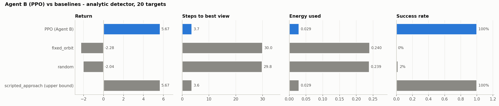
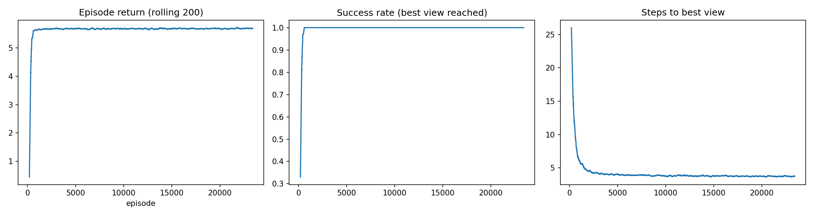
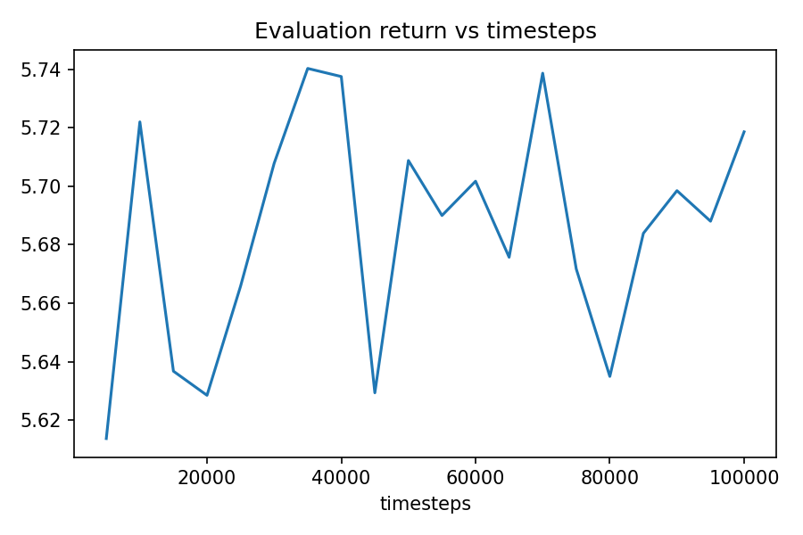
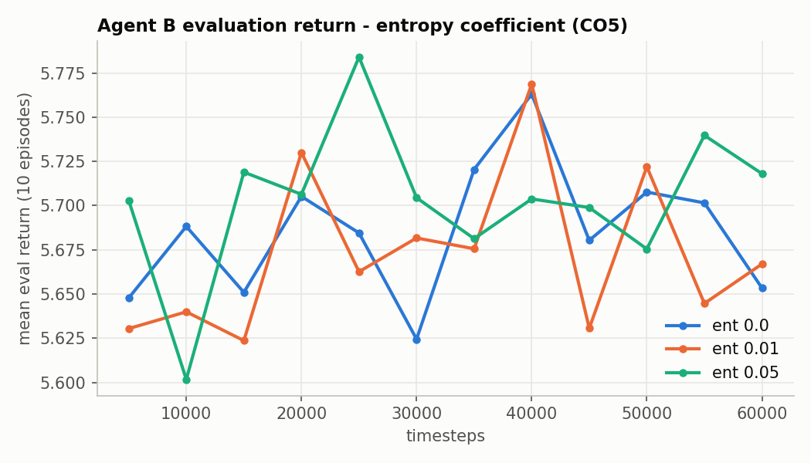
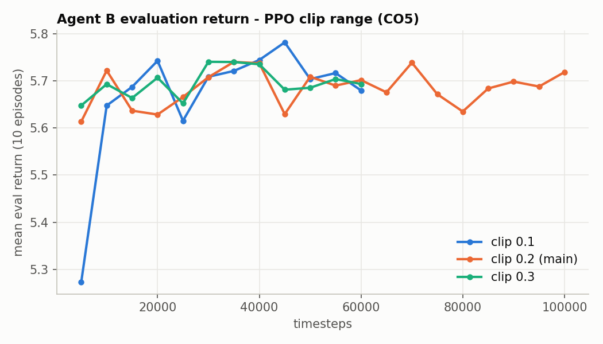
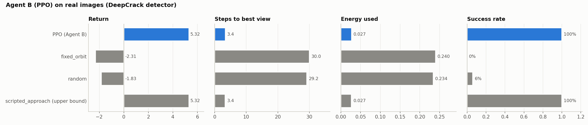
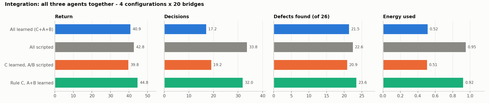
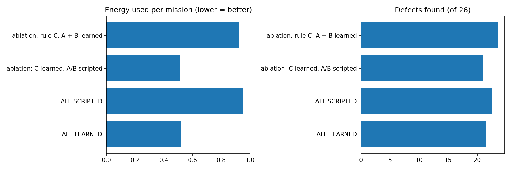

# Leekhith: Agent B (PPO Active View Refiner), Integration and Team Results

**Team 08 · 22AIE401 Reinforcement Learning · Uncertainty-Aware Active Vision for UAV Inspection**

This folder collects everything Leekhith built and every result and plot from these experiments.
The source runs are in `For_Leekhith/agentB*/` and `For_Leekhith/full/`, and the notebook is
`For_Leekhith/Leekhith_AgentB_Integration.ipynb`.

## 1. What Leekhith did

| Contribution | Where it lives |
|---|---|
| Designed, trained and analysed **Agent B**, a PPO agent with **continuous** actions that moves the camera close to a suspicious cell to get the best view | `uav_inspection/scripts/train_agent_b.py`, `agentB/` |
| **Potential-based reward shaping** (Ng et al. 1999) that speeds learning without changing the optimal policy | refine-mode reward |
| **Sensitivity study (CO5)** with 5 extra runs: entropy coefficient 0.0 / 0.01 / 0.05 and clip range 0.1 / 0.3 | `agentB_ent*/`, `agentB_clip*/` |
| Convergence and sample-efficiency analysis (CO4) plus a live policy demo (CO3) | notebook Steps 5–6 |
| **Agent B on real images** (DeepCrack detector) | `agentB_learned/` |
| **Integration (`full` mode)**: ran all three trained agents together, a **4-way ablation** and a narrated demo mission | `uav_inspection/scripts/run_full_mode.py`, `full/` |
| Team metrics, plots and the team summary figure. Report and poster assembly. | `full/team_summary.png` |

## 2. Agent B design (MDP)

| | |
|---|---|
| State (6) | distance, viewing angle, lateral offset, target uncertainty, battery, steps left |
| Actions | continuous Box(3) in [−1, 1]: Δdistance, Δangle, Δlateral (× 0.2 per step) |
| Dynamics | view score s = 1 − 0.6 d − 0.4·abs(angle) − 0.3·abs(lateral); view quality q = round(4 s) |
| Reward | 1.0 × Δuncertainty − 0.01·abs(a) + 0.5 × (0.99 s′ − s) **shaping**; +5 success; −2 timeout |
| Episode | ≤ 30 steps; success = best view (q = 4) |
| Algorithm | PPO (SB3), MLP [64, 64], lr 3e-4, γ 0.99, clip 0.2, n_steps 256, batch 64, 10 epochs, GAE λ 0.95, 4 envs, 100k steps |

PPO fits here because the actions are continuous, and DQN cannot handle continuous actions.

## 3. Results

### 3.1 PPO vs baselines (analytic detector, 20 targets)



| Policy | Return | Steps | Success | Energy |
|---|---|---|---|---|
| **PPO (Agent B)** | **5.67** | **3.66** | **100 %** | **0.029** |
| fixed_orbit | −2.28 | 30.0 | 0 % | 0.240 |
| random | −2.04 | 29.8 | 2 % | 0.239 |
| scripted_approach (upper bound, uses privileged geometry) | 5.67 | 3.64 | 100 % | 0.029 |

PPO **matches the privileged upper bound** after about 2 minutes of training, using 8× less energy than orbiting.

### 3.2 Learning curves and convergence (CO4)




| Measure | Value |
|---|---|
| Episodes trained | 23,420 (100,345 env steps) |
| Convergence (rolling success ≥ 95 %) | episode 436 = **8,555 env steps** |
| Training time | 2.1 min (CPU) |

**Live demo (CO3), one episode:** the Gaussian policy outputs Δdistance ≈ −1 each step and corrects angle and
lateral offset. The view score rises 0.35 → 0.58 → 0.72 → 0.86, and on step 4 the best view (q = 4)
is reached with reward +5.17.

### 3.3 Hyperparameter sensitivity (CO5)




| Run | Training steps | Return | Steps | Success | Energy |
|---|---|---|---|---|---|
| main (ent 0.0, clip 0.2) | 100k | 5.670 | 3.66 | 100 % | 0.029 |
| ent 0.0 | 60k | 5.670 | 3.66 | 100 % | 0.029 |
| ent 0.01 | 60k | 5.668 | 3.70 | 100 % | 0.030 |
| ent 0.05 | 60k | 5.669 | 3.64 | 100 % | 0.029 |
| clip 0.1 | 60k | 5.672 | 3.66 | 100 % | 0.029 |
| clip 0.3 | 60k | 5.669 | 3.66 | 100 % | 0.029 |

Every setting reaches 100 % success in 3.6–3.7 steps, so **the refine task is robust to these hyperparameters**.

### 3.4 Agent B on real images (DeepCrack detector)



| Policy | Return | Steps | Success | Energy |
|---|---|---|---|---|
| **PPO (Agent B)** | **5.32** | **3.40** | **100 %** | 0.027 |
| fixed_orbit | −2.31 | 30.0 | 0 % | 0.240 |
| random | −1.83 | 29.2 | 6 % | 0.234 |
| scripted_approach (upper bound) | 5.32 | 3.36 | 100 % | 0.027 |

The policy transfers to real-image uncertainty and again matches the upper bound.

### 3.5 Integration: all three agents together (4-way ablation, 20 bridges)




| Config | Return | Decisions | Coverage | Defects /26 | mIoU | Energy |
|---|---|---|---|---|---|---|
| **All learned (C + A + B)** | 40.94 | **17.2** | 0.998 | 21.5 | 0.528 | **0.517** |
| All scripted (rule + raster + approach) | 42.82 | 33.8 | 1.00 | 22.55 | 0.597 | 0.954 |
| Ablation: C learned, A/B scripted | 39.84 | 19.3 | 1.00 | 20.95 | 0.500 | 0.510 |
| Ablation: rule C, A + B learned | **44.84** | 32.1 | 0.999 | **23.55** | **0.623** | 0.925 |

All four configurations reach 100 % safe return.
- The **fully learned hierarchy uses 46 % less energy** and half the decisions of the scripted system, at the cost of about 1 defect per mission.
- **Learned A + B under a rule supervisor is the best overall** (highest return, most defects, best mIoU). This shows that the learned navigator and refiner beat their scripted counterparts.
- Agent C returns home early to save battery. It was trained with scripted sub-agents, so the learned ones shift its input distribution (Mukhesh's `agentC_withA` run addresses this).

**Narrated demo mission** (`results/demo_mission.txt`): Agent C chooses Explore (→ Agent A) 15 times,
reaches 100 % coverage, finds **24 / 26 defects** and returns home safely with 46 % battery left
(return 45.73, mIoU 0.509).

## 4. Files in this folder

```
plots/
  ppo_vs_baselines.png              PPO vs fixed_orbit / random / scripted upper bound
  learning_curves.png               training return / success / episode length
  eval_curve.png                    evaluation return vs timesteps
  sensitivity_entropy.png           eval curves, entropy 0.0 / 0.01 / 0.05 (CO5)
  sensitivity_clip.png              eval curves, clip 0.1 / 0.2 / 0.3 (CO5)
  ppo_real_images_vs_baselines.png  real-image (DeepCrack) comparison
  integration_ablation.png          4 configs: return, decisions, defects, energy
  team_summary.png                  energy + defects per config (team slides / poster)
results/
  agentB_all_runs_summary.csv       one row per run (main, ent*, clip*, learned)
  agentB_<run>_vs_baselines.csv     full metric mean/std table for each run
  agentB_<run>_hyperparams.json     exact training settings for each run
  full_mode_results.csv             integration results, 4 configs
  demo_mission.txt                  narrated end-to-end mission + final uncertainty map
  baselines_summary_analytic.csv    all baselines, analytic detector
```

Trained model (not copied here): `For_Leekhith/agentB/best/best_model.zip`, loaded with `PPO.load(...)`.
