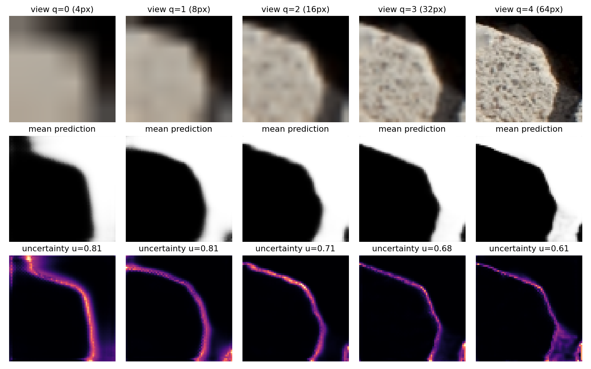
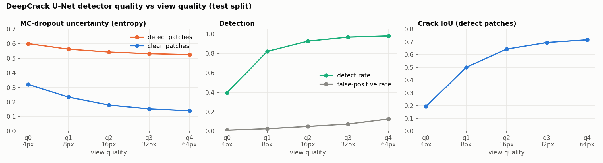
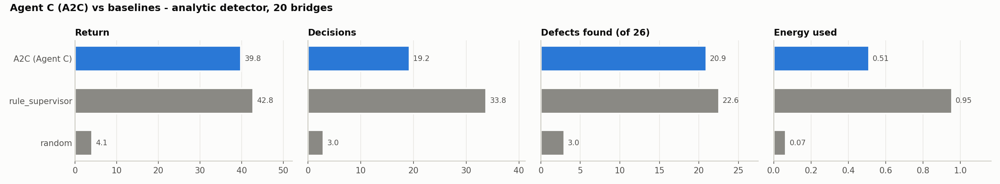
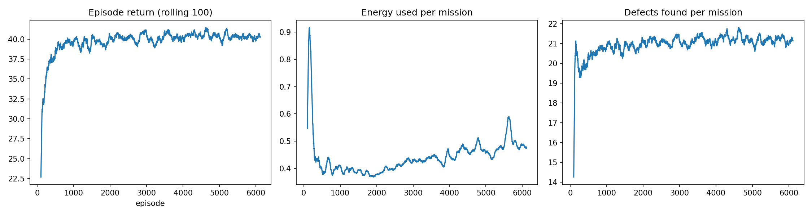
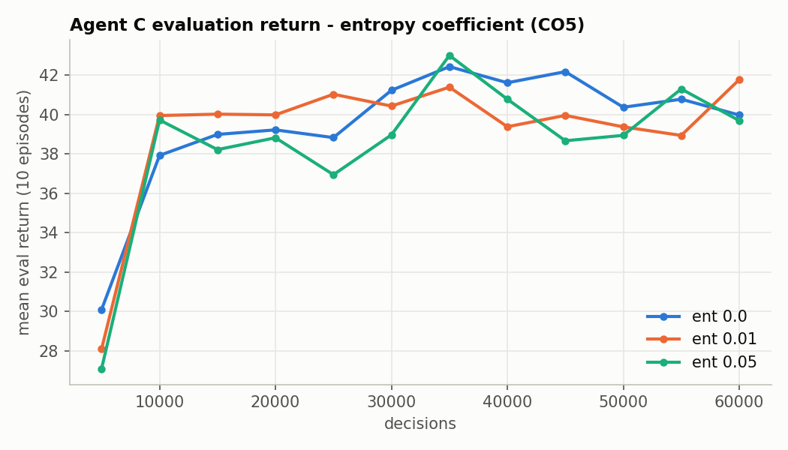
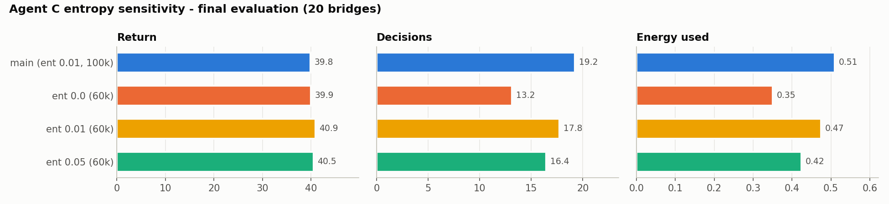
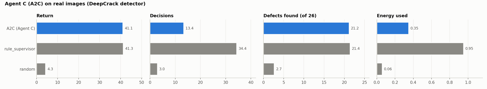
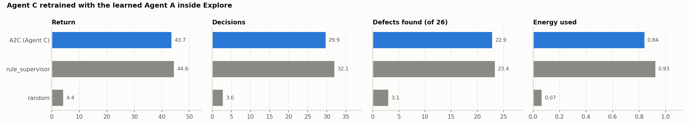

# Mukhesh: Real-Image Crack Detector (DeepCrack U-Net) and Agent C (A2C Mission Supervisor)

**Team 08 · 22AIE401 Reinforcement Learning · Uncertainty-Aware Active Vision for UAV Inspection**

This folder collects everything Mukhesh built and every result and plot from these experiments.
The source runs are in `For_Mukhesh/` and the notebook is `For_Mukhesh/Mukhesh_Cache_AgentC.ipynb`.

## 1. What Mukhesh did

| Contribution | Where it lives |
|---|---|
| Trained a **U-Net crack segmenter** on the DeepCrack dataset (Colab T4 GPU) | `uav_inspection/scripts/build_detector_cache.py`, `For_Mukhesh/unet_deepcrack.pt` |
| Built the **real-image uncertainty cache** with **MC-dropout** (10 passes) at 5 view qualities. It powers `detector="learned"` for all three agents. | `For_Mukhesh/detector_cache.npz` |
| Evaluated and calibrated the detector (uncertainty, detect rate, false positives, IoU per view quality; success threshold) | `results/detector_report.json` |
| Designed, trained and analysed **Agent C**, an A2C **hierarchical supervisor** that chooses between Explore, Refine and Return home | `uav_inspection/scripts/train_agent_c.py`, `agentC/` |
| **Entropy sensitivity study (CO5)** with 3 extra runs | `agentC_ent0.0/0.01/0.05/` |
| **Agent C on real images** | `agentC_learned/` |
| **Agent C retrained with the learned Agent A** inside Explore (true hierarchical training) | `agentC_withA/` |

## 2. The real-image detector

Pipeline (about 10 min on a T4):
1. Train a small U-Net on 64×64 crops from the DeepCrack **train** split (4000 iterations).
2. Cut 64×64 patches from the **test** split only, so there is no leakage (1200 defect + 1800 clean).
3. For each patch and each view quality q = 0..4 (4 / 8 / 16 / 32 / 64 px), run **10 MC-dropout passes** and record:
   `u` = predictive entropy (rank-normalised), `pdef` = crack predicted, `iou` vs the ground truth.

**Why entropy and not dropout std?** Blurred views make the network *falsely confident*. Std does not
rise on those views, but predictive entropy does.




| q | Resolution | u (defect) | u (clean) | Detect rate | False pos. | IoU (defect) |
|---|---|---|---|---|---|---|
| 0 | 4 px | 0.601 | 0.321 | 39.8 % | 0.9 % | 0.193 |
| 1 | 8 px | 0.563 | 0.234 | 82.2 % | 2.4 % | 0.501 |
| 2 | 16 px | 0.543 | 0.179 | 92.8 % | 4.8 % | 0.644 |
| 3 | 32 px | 0.532 | 0.153 | 96.9 % | 7.3 % | 0.696 |
| 4 | 64 px | 0.526 | 0.140 | 98.2 % | 12.5 % | 0.717 |

Uncertainty goes **down** and IoU goes **up** as the view improves, which is what the agents need.
Calibrated success threshold `success_unc` = **0.282**. Altitude → quality map `alt_q` = [0, 1, 3]
(high = q0, mid = q1, low = q3).

## 3. Agent C design (semi-MDP / options)

| | |
|---|---|
| State (6) | battery, coverage, mean uncertainty, fraction of defects found, distance to base, time used |
| Actions | Discrete(3) **options**: Explore (5 Agent-A steps), Refine (≤ 10 Agent-B steps on the most uncertain cell in view), Return home |
| Reward | +2 per new defect − 0.5 × energy; −10 if the battery empties |
| Episode | ≤ 40 decisions; success = safe return |
| Algorithm | A2C (SB3), MLP [64, 64], lr 7e-4, γ 0.99, n_steps 8, ent 0.01, vf 0.5, 4 envs, 100k decisions |

## 4. Results

### 4.1 A2C vs baselines (analytic detector, 20 bridges)




| Policy | Return | Decisions | Safe return | Defects /26 | mIoU | Energy |
|---|---|---|---|---|---|---|
| **A2C (Agent C)** | 39.8 | **19.3** | 100 % | 20.95 | 0.500 | **0.51** |
| rule_supervisor | **42.8** | 33.8 | 100 % | **22.55** | **0.597** | 0.95 |
| random | 4.1 | 3.0 | 100 % | 2.95 | 0.072 | 0.07 |

A2C gets **within about 7 % of the rule-based return using about half the energy and half the decisions**.
It rarely chooses Refine, because under this reward refining costs energy and seldom confirms *new* defects.
Training took 3.5 min (final evaluation return 39.6 ± 5.1).

**Live demo (CO3):** at the start of a mission the policy gives π(Explore) = 0.99, π(Refine) = 0.01,
π(Return) = 0.00. Each Explore option finds 2–4 new defects (reward +2 to +6).

### 4.2 Entropy sensitivity (CO5)




| Run | Training decisions | Return | Decisions | Defects /26 | mIoU | Energy |
|---|---|---|---|---|---|---|
| main (ent 0.01) | 100k | 39.8 | 19.3 | 20.95 | 0.500 | 0.51 |
| ent 0.0 | 60k | 39.9 | 13.2 | 20.95 | 0.500 | **0.35** |
| ent 0.01 | 60k | **40.9** | 17.8 | **21.45** | **0.521** | 0.47 |
| ent 0.05 | 60k | 40.5 | 16.5 | 21.25 | 0.515 | 0.42 |

Return is stable (39.8–40.9) across entropy values. With no entropy bonus the policy commits to returning
home earliest and uses the least energy.

### 4.3 Agent C on real images (DeepCrack detector)



| Policy | Return | Decisions | Defects /26 | mIoU | Energy |
|---|---|---|---|---|---|
| **A2C (Agent C)** | 41.1 | **13.4** | 21.2 | 0.494 | **0.35** |
| rule_supervisor | 41.3 | 34.4 | 21.45 | 0.526 | 0.95 |
| random | 4.3 | 3.0 | 2.7 | 0.061 | 0.06 |

On real images A2C gets **the same return as the rule supervisor with 63 % less energy**.

### 4.4 Agent C retrained with the learned Agent A inside Explore



| Policy | Return | Decisions | Defects /26 | mIoU | Energy |
|---|---|---|---|---|---|
| A2C + learned Agent A | 43.7 | 29.9 | 22.95 | 0.589 | **0.84** |
| rule_supervisor (same Agent A inside) | 44.6 | 32.2 | 23.45 | 0.625 | 0.93 |

When trained with its real sub-agent, C explores longer (0.84 energy instead of 0.51) and finds 2 more
defects. It gets **within 2 % of the rule supervisor's return with about 9 % less energy**.

## 5. Files in this folder

```
plots/
  detector_views.png                example patch at q0..q4: image, mean prediction, uncertainty map
  detector_quality.png              uncertainty / detect rate / IoU vs view quality
  a2c_vs_baselines.png              A2C vs rule_supervisor / random
  learning_curves.png               training return / decisions / success
  sensitivity_entropy.png           eval curves, entropy 0.0 / 0.01 / 0.05 (CO5)
  sensitivity_entropy_bars.png      final return / decisions / energy per entropy value
  a2c_real_images_vs_baselines.png  real-image (DeepCrack) comparison
  a2c_withA_vs_baselines.png        A2C retrained with learned Agent A
results/
  detector_report.json / .csv       per-quality detector metrics + calibrated thresholds
  agentC_all_runs_summary.csv       one row per run (main, ent*, learned, withA)
  agentC_<run>_vs_baselines.csv     full metric mean/std table for each run
  agentC_<run>_hyperparams.json     exact training settings for each run
  baselines_summary_analytic.csv    all baselines, analytic detector
```

Large artifacts (not copied here): `For_Mukhesh/unet_deepcrack.pt`, `For_Mukhesh/detector_cache.npz`,
and `For_Mukhesh/agentC/best/best_model.zip` (`A2C.load(...)`).
