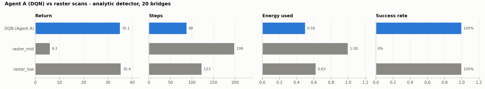
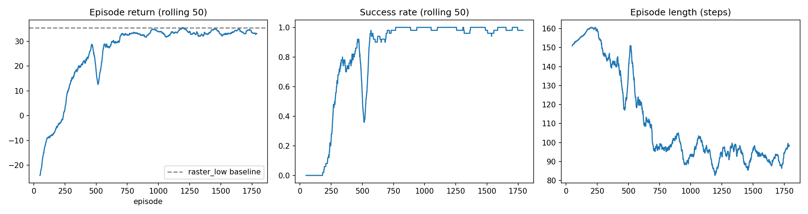
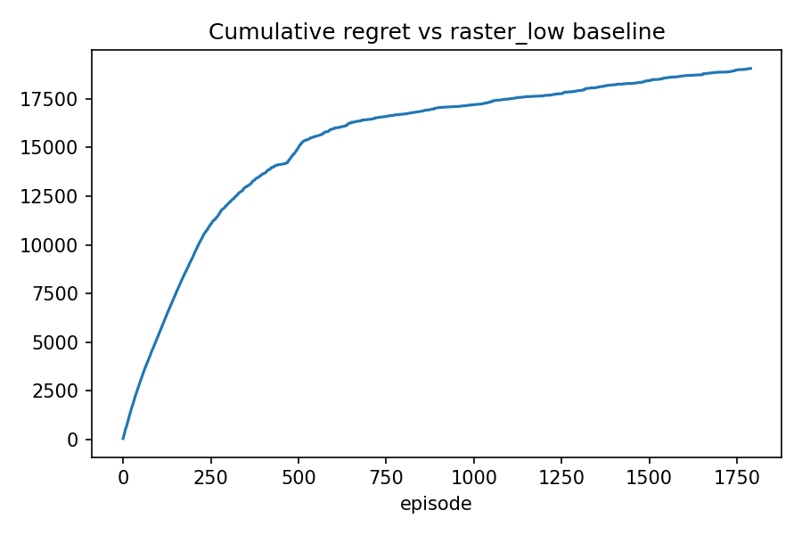
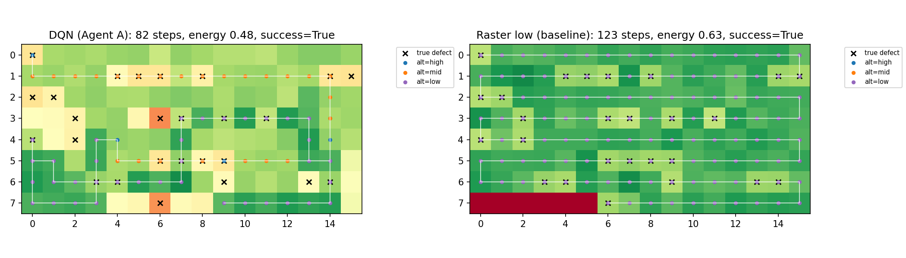
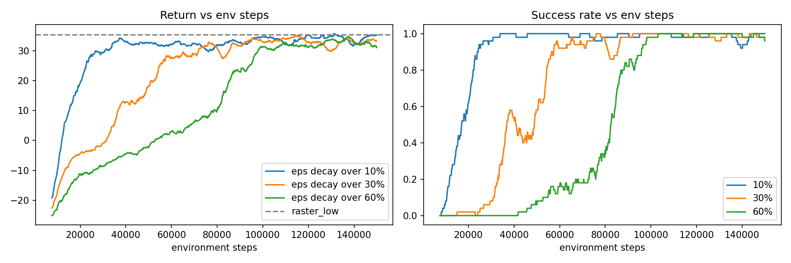
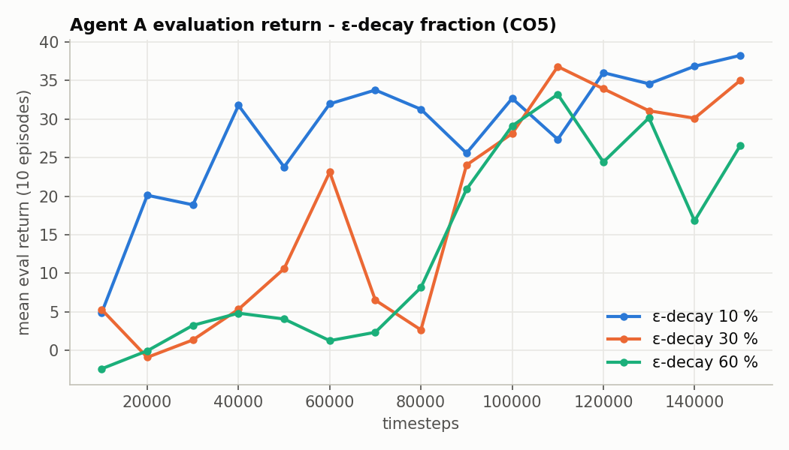
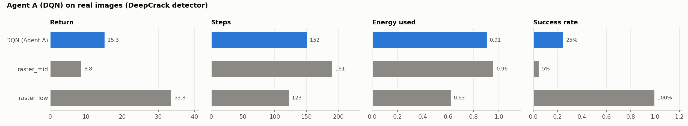
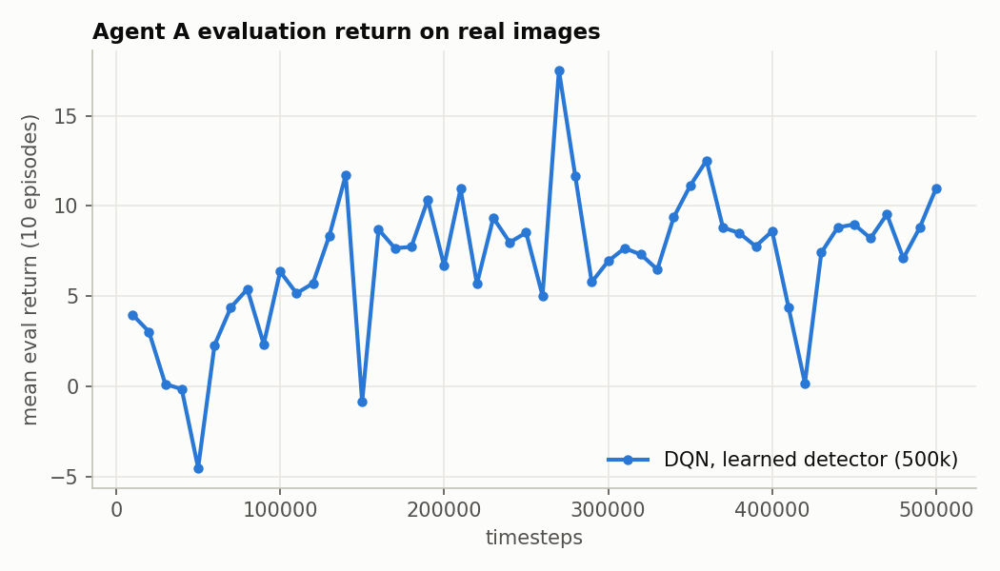

# Yeseswini: Shared Environment, Baselines and Agent A (DQN Viewpoint Planner)

**Team 08 · 22AIE401 Reinforcement Learning · Uncertainty-Aware Active Vision for UAV Inspection**

This folder collects everything Yeseswini built and every result and plot from the Agent A experiments.
The source runs are in `uav_inspection/agentA*/` and the notebook is `uav_inspection/Yeseswini_AgentA.ipynb`.

## 1. What Yeseswini did

| Contribution | Where it lives |
|---|---|
| Designed and wrote the **shared Gymnasium environment** (`InspectionEnv`: 8×16 bridge grid, battery, camera footprint by altitude, 4 modes × 2 detectors). All three agents use it. | `uav_inspection/env/inspection_env.py` |
| Wrote the **baseline policies** (raster scans, fixed orbit, scripted approach, rule supervisor, random) and the seeded `evaluate()` / `summarize()` harness. Every comparison uses the same 20 bridges. | `uav_inspection/env/baselines.py`, `scripts/run_baselines.py` |
| Plugged Mukhesh's **real-image detector cache** into the environment (`detector="learned"`) | `inspection_env.py` |
| Designed, trained and analysed **Agent A**, a DQN that decides where to fly and at what altitude | `scripts/train_agent_a.py`, `agentA/` |
| **ε-decay sensitivity study (CO5)** with 3 extra DQN runs | `agentA_eps0.1/0.3/0.6/` |
| Convergence, sample-efficiency and **regret analysis (CO4)**, and the flight-path poster figure | notebook Steps 12–13 |
| **Agent A on real images**: 500k-step DQN with the DeepCrack detector | `agentA_learned/` |
| Report section (LaTeX) plus slide, poster and viva plan | `docs/` in this folder |

## 2. Agent A design (MDP)

| | |
|---|---|
| State (118) | egocentric 7×7 window of [visited, uncertainty] + 2×4 block summary [coverage, mean uncertainty] + [row, col, altitude, battery] |
| Actions | Discrete(6): North, South, East, West, Climb, Descend |
| Reward | 0.2 × total uncertainty reduced − 0.01/step − 0.05 revisit − 1 out-of-bounds; on success +10 + 20 × battery left |
| Episode | ≤ 200 steps; success = coverage ≥ 95 % **and** mean uncertainty ≤ 0.32 |
| Algorithm | DQN (SB3), MLP [256, 256], lr 5e-4, γ 0.995, buffer 100k, batch 128, target update 1000, ε 1.0 → 0.05 over 30 %, 200k steps |

**Design lessons learned while building it**
- A global one-hot position (386 inputs) **did not learn**. The **egocentric** 7×7 window fixed this.
- Separate coverage and uncertainty rewards led to **reward hacking**. Rewarding *total uncertainty reduced* plus a battery-scaled success bonus fixed that.

## 3. Results

### 3.1 DQN vs raster scans (analytic detector, 20 bridges)



| Metric | Raster mid | Raster low (dense) | **DQN (Agent A)** |
|---|---|---|---|
| Success | 0 % | 100 % | **100 %** |
| Steps | 199 | 123 | **88.3 (−28 %)** |
| Energy used | 1.00 | 0.625 | **0.50 (−20 %)** |
| Coverage | 100 % | 95.3 % | 99.9 % |
| Mean uncertainty | 0.351 | 0.219 | 0.319 |
| Defects found (/26) | 20.95 | 23.5 | 21.8 |
| mIoU | 0.500 | 0.626 | 0.539 |
| Return | 6.20 | 35.43 | 35.06 |

The DQN matches the dense raster's 100 % success with **28 % fewer steps and 20 % less energy**. It does
only enough to meet the uncertainty threshold, so the raster's over-inspection keeps a higher mIoU.

### 3.2 Learning curves, convergence and regret (CO4)





| Measure (main run, 200k steps) | Value |
|---|---|
| Episodes trained | 1,790 (199,957 env steps) |
| Convergence (rolling success ≥ 95 %) | episode 563 = **82,064 env steps** |
| Sample efficiency (95 % of raster_low return) | episode 938 = 120,311 env steps |
| Final 100-episode training return | 33.75 ± 3.74 |
| Cumulative regret vs raster_low | 19,047 (the last 200 episodes add only 402, so regret has flattened) |
| Training time | 5.7 min (CPU) |

### 3.3 Flight path: DQN vs raster (poster figure)



### 3.4 ε-decay sensitivity (CO5)

ε decays 1.0 → 0.05 over 10 %, 30 % or 60 % of a 150k-step run.




| ε-decay fraction | Return | Steps | Success | Energy | mIoU |
|---|---|---|---|---|---|
| **10 %** | **37.8** | **74.7** | 100 % | **0.40** | **0.559** |
| 30 % | 34.5 | 92.7 | 100 % | 0.52 | 0.552 |
| 60 % | 28.1 | 120.7 | 80 % | 0.64 | 0.539 |

Shorter exploration worked best: with a long ε schedule too little of the budget is left to exploit what was learned.

### 3.5 Agent A on real images (DeepCrack detector, 500k steps)




| Policy | Return | Success | Steps | Energy | mIoU |
|---|---|---|---|---|---|
| DQN (Agent A, learned detector) | 15.3 | 25 % | 151.6 | 0.91 | 0.523 |
| raster_mid | 8.8 | 5 % | 191.5 | 0.96 | 0.494 |
| raster_low | **33.8** | **100 %** | 123.1 | 0.63 | 0.668 |

This task is much harder. Real-image uncertainty is noisier, and the calibrated threshold is stricter
(0.282 instead of 0.32). The DQN beats raster_mid but **not** the dense raster. The analytic results
above remain Agent A's main result, and this run counts as sample-efficiency evidence.

### 3.6 Baselines Yeseswini wrote (analytic, 20 episodes)

| Mode | Policy | Return | Steps | Success | Energy |
|---|---|---|---|---|---|
| navigate | random | −29.6 | 148.7 | 0 % | 1.00 |
| navigate | raster_mid | 6.2 | 199 | 0 % | 1.00 |
| navigate | raster_low | 35.4 | 123 | 100 % | 0.63 |
| refine | random | −2.24 | 30 | 0 % | 0.24 |
| refine | fixed_orbit | −2.29 | 30 | 0 % | 0.24 |
| refine | scripted_approach | 5.68 | 3.5 | 100 % | 0.03 |
| supervise | random | 4.1 | 3.0 | 100 % | 0.07 |
| supervise | rule_supervisor | 42.8 | 33.8 | 100 % | 0.95 |

## 4. Files in this folder

```
plots/
  dqn_vs_baselines.png              DQN vs raster_mid / raster_low (return, steps, energy, success)
  learning_curves.png               training return / success / episode length (main run)
  regret.png                        cumulative regret vs raster_low (CO4)
  trajectories.png                  flight path DQN vs raster (poster)
  eps_sensitivity.png               ε-decay comparison from the notebook (CO5)
  eval_curves_eps_decay.png         evaluation return over training, 3 ε schedules
  dqn_real_images_vs_baselines.png  real-image (DeepCrack) comparison
  eval_curve_real_images.png        evaluation return over 500k steps, real images
results/
  agentA_all_runs_summary.csv       one row per run (main, eps0.1/0.3/0.6, learned)
  agentA_<run>_vs_baselines.csv     full metric mean/std table for each run
  agentA_<run>_hyperparams.json     exact training settings for each run
  baselines_summary_analytic.csv    all baselines, analytic detector
  baselines_summary_learned.csv     all baselines, real-image detector
docs/
  AgentA_report_section.tex         LaTeX section for the final report
  AgentA_slides_poster_viva.md      slide plan, poster layout, viva answers
```

Trained models (not copied here because of size): `uav_inspection/agentA/best/best_model.zip`, plus a checkpoint every 25k steps in `agentA/checkpoints/`.
